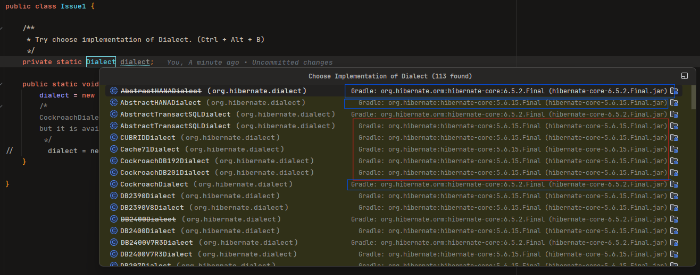

# IDEA-356409

### Links

* [Question-about-Multi-Module-Gradle-Projects-Depending-on-Multiple-Versions-of-the-Same-Library](https://youtrack.jetbrains.com/issue/IDEA-356409)
* [IDEA-356846](https://youtrack.jetbrains.com/issue/IDEA-356409)

---

## Steps to reproduce

1. Clone the this Project.
   Note that the Project has two separate, isolated Modules one uses Hibernate 5 and another Hibernate 6.
2. Open `io/github/honhimw/idea/issue/Issue1.java`, go to line 16 `private static Dialect dialect` open
   the `Choose Implementation` dialog `Ctrl + Alt + B` for the Dialect variable.

### Expected result:

Only the options from the hibernate(5/6) and its Parent Project should be suggested.

### Actual result:
`Choose Implementation` dialog suggests options from the both of hibernate5 and hibernate6 module:

